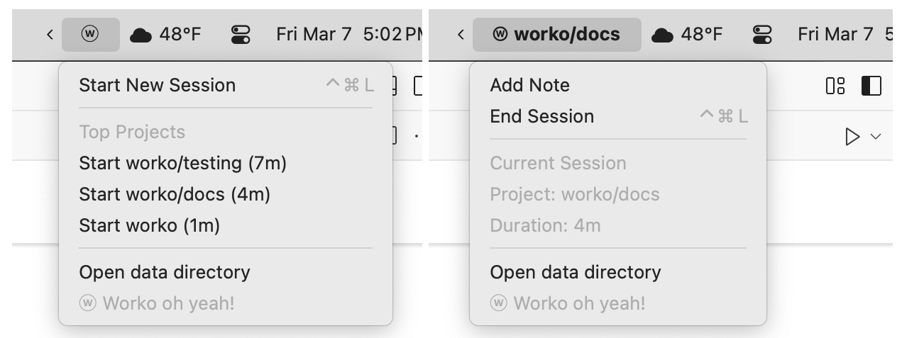
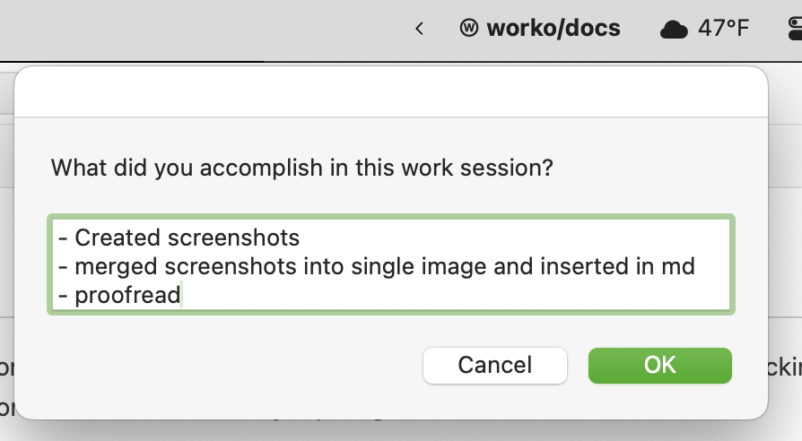

# Worko

ⓦ Worko is a [Swiftbar](https://swiftbar.app) plugin for tracking time spent on projects.  I've written this tool to duplicate a workflow I used with a long-lost [Freshbooks](https://freshbooks.com) Dashboard widget.  Having easy stop/start tracking with annotations allows me to provide granular reporting for detail-focused clients (in this case I'm the client).  Session data is stored in CSV files for easy report generation. 

## Using ⓦ Worko:

1. When you start work, start a session and enter a tag for your current project.
2. As you accomplish sub-tasks you may append them as notes to the working session.
3. When you've completed your work, end the session and save a summary of your results.

Worko saves this data in a CSV file you can later process in a spreadsheet to generate tracking or invoicing.  View this data by selecting the "Open data directory" menu item.  The Worko directory is "~/.worko_data" and can be changed by editing the plugin file.

### Project Scoreboard

Worko can be used as a scoreboard to track how much time you're investing in your work.  The menu
will show your top three projects in the last 7 days and how long you've spent in each.    The idea of having a scoreboard for my projects came from Cal Newport's book [_Deep Work_](https://bookshop.org/p/books/deep-work-rules-for-focused-success-in-a-distracted-world-cal-newport/8339760?ean=9781455586691&next=t).

You may adjust the number of projects shown in the scoreboard and the rolling window for work totals on projects by editing the plugin file.

Bonsu: Select a project in the menu as a shortcut to starting a new working session.

## Installing ⓦ Worko:

Download [worko.1s.py](https://raw.githubusercontent.com/billmerrill/worko/refs/heads/main/worko.1s.py) and save it in your
Swiftbar Plugins folder.  By default you'll find this in "~/Applications/SwiftBar Plugins".